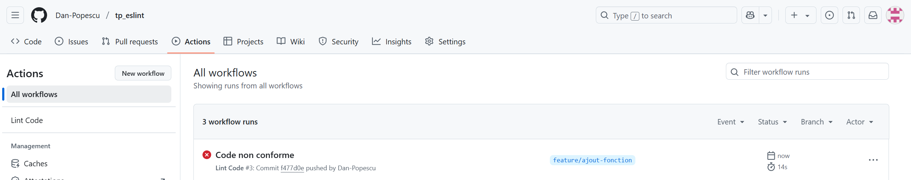

# tp_eslint

## 2. Test d’ESLint sur un fichier JavaScript (index.js)

### 2.2

popes@LAPTOP-IVJGI2IE MINGW64 /c/ESGI/3A/Outils et pratiques de code/tp_note/tp_eslint_git (main)
$ npx eslint index.js

C:\ESGI\3A\Outils et pratiques de code\tp_note\tp_eslint_git\index.js
7:7 error 'unusedVar' is assigned a value but never used no-unused-vars
19:7 error 'message' is assigned a value but never used no-unused-vars
21:5 error Unexpected constant condition no-constant-condition
25:7 error 'tableau' is assigned a value but never used no-unused-vars
36:10 error 'toutFaire' is defined but never used no-unused-vars
56:7 error 'd' is assigned a value but never used no-unused-vars
58:10 error 'fetchData' is defined but never used no-unused-vars
63:7 error 'nombres' is assigned a value but never used no-unused-vars
67:1 error Unexpected 'debugger' statement no-debugger

✖ 9 problems (9 errors, 0 warnings)

### 2.3 Correction

suppression des variables non utiliées

## 3.Intégration avec Git Hooks (Husky)

$ git commit -m "Test du hook ESLint correct"

> tp-eslint-git@1.0.0 test
> echo "Error: no test specified" && exit 1

"Error: no test specified"
husky - pre-commit script failed (code 1)

**J'ai remplacé la commande tests dans package.json pour quelle exécute index avec des vérifications de linter avant de faire le commit**

**J'obtients désormais:**

---

popes@LAPTOP-IVJGI2IE MINGW64 /c/ESGI/3A/Outils et pratiques de code/tp_note/tp_eslint_git (main)
$ git commit -m "Test du hook ESLint correct"

> tp-eslint-git@1.0.0 test  
> npx eslint app.js

[main 1b93bbf] Test du hook ESLint correct  
 4 files changed, 9 insertions(+), 12 deletions(-)  
 create mode 100644 .husky/pre-commit  
 delete mode 100644 eslint.js

## 4. Configuration avancée d’ESLint

popes@LAPTOP-IVJGI2IE MINGW64 /c/ESGI/3A/Outils et pratiques de code/tp_note/tp_eslint_git (main)
$ npm run lint

> tp-eslint-git@1.0.0 lint

> tp-eslint-git@1.0.0 lint
> tp-eslint-git@1.0.0 lint
> eslint .

Oops! Something went wrong! :(

ESLint: 9.28.0

TypeError: Plugin "" not found.
at findPluginConfig (C:\ESGI\3A\Outils et pratiques de code\tp_note\tp_eslint_git\node_modules\@eslint\config-helpers\dist\cjs\index.cjs:251:9)
at C:\ESGI\3A\Outils et pratiques de code\tp_note\tp_eslint_git\node_modules\@eslint\config-helpers\dist\cjs\index.cjs:415:25
at Array.map (<anonymous>)
at processExtends (C:\ESGI\3A\Outils et pratiques de code\tp_note\tp_eslint_git\node_modules\@eslint\config-helpers\dist\cjs\index.cjs:413:36)
at C:\ESGI\3A\Outils et pratiques de code\tp_note\tp_eslint_git\node_modules\@eslint\config-helpers\dist\cjs\index.cjs:485:38
at Array.flatMap (<anonymous>)
at processConfigList (C:\ESGI\3A\Outils et pratiques de code\tp_note\tp_eslint_git\node_modules\@eslint\config-helpers\dist\cjs\index.cjs:485:20)
at defineConfig (C:\ESGI\3A\Outils et pratiques de code\tp_note\tp_eslint_git\node_modules\@eslint\config-helpers\dist\cjs\index.cjs:520:9)
at file:///C:/ESGI/3A/Outils%20et%20pratiques%20de%20code/tp_note/tp_eslint_git/eslint.config.mjs?mtime=1749653285252:6:16
at ModuleJob.run (node:internal/modules/esm/module_job:218:25)

J'ai modifié la configuration eslintrc.js comme ceci :

```
module.exports = {
  extends: "airbnb-base",
  rules: {
    "no-console": "warn",
    indent: ["error", 2],
    quotes: ["error", "single"],
  },
  env: {
    browser: true,
    node: true,
  },
};
```

Désormais, quand j'exécute npm run lint, j'ai :

"""
tp-eslint-git@1.0.0 lint

> eslint .

C:\ESGI\3A\Outils et pratiques de code\tp_note\tp_eslint_git\.eslintrc.js
1:19 error Expected linebreaks to be 'LF' but found 'CRLF' linebreak-style
2:12 error Strings must use singlequote quotes
2:26 error Expected linebreaks to be 'LF' but found 'CRLF' linebreak-style
3:11 error Expected linebreaks to be 'LF' but found 'CRLF' linebreak-style
4:5 error Strings must use singlequote quotes
4:19 error Strings must use singlequote quotes
4:26 error Expected linebreaks to be 'LF' but found 'CRLF' linebreak-style
5:14 error Strings must use singlequote quotes
5:26 error Expected linebreaks to be 'LF' but found 'CRLF' linebreak-style
6:14 error Strings must use singlequote quotes
6:23 error Strings must use singlequote quotes
6:33 error Expected linebreaks to be 'LF' but found 'CRLF' linebreak-style
7:5 error Expected linebreaks to be 'LF' but found 'CRLF' linebreak-style
8:9 error Expected linebreaks to be 'LF' but found 'CRLF' linebreak-style
9:19 error Expected linebreaks to be 'LF' but found 'CRLF' linebreak-style
10:16 error Expected linebreaks to be 'LF' but found 'CRLF' linebreak-style
11:5 error Expected linebreaks to be 'LF' but found 'CRLF' linebreak-style
12:3 error Expected linebreaks to be 'LF' but found 'CRLF' linebreak-style

C:\ESGI\3A\Outils et pratiques de code\tp_note\tp_eslint_git\app.js
1:14 error Expected linebreaks to be 'LF' but found 'CRLF' linebreak-style
2:1 error Expected linebreaks to be 'LF' but found 'CRLF' linebreak-style
3:1 warning Unexpected console statement no-console
3:16 error Expected linebreaks to be 'LF' but found 'CRLF' linebreak-style
4:1 error Expected linebreaks to be 'LF' but found 'CRLF' linebreak-style
5:18 error Expected linebreaks to be 'LF' but found 'CRLF' linebreak-style
6:1 warning Unexpected console statement no-console
6:1 error Expected indentation of 2 spaces but found 0 indent
6:13 error Strings must use singlequote quotes
6:21 error Expected linebreaks to be 'LF' but found 'CRLF' linebreak-style
7:2 error Expected linebreaks to be 'LF' but found 'CRLF' linebreak-style
8:1 error Expected linebreaks to be 'LF' but found 'CRLF' linebreak-style
9:8 error Expected linebreaks to be 'LF' but found 'CRLF' linebreak-style

C:\ESGI\3A\Outils et pratiques de code\tp_note\tp_eslint_git\index.js
1:23 error A space is required after ',' comma-spacing
1:26 error Missing space before opening brace space-before-blocks
1:27 error Expected linebreaks to be 'LF' but found 'CRLF' linebreak-style
2:1 error Expected indentation of 2 spaces but found 0 indent
2:5 error 'result' is never reassigned. Use 'const' instead prefer-const
2:11 error Operator '=' must be spaced space-infix-ops
2:13 error Operator '+' must be spaced space-infix-ops
2:15 error Expected linebreaks to be 'LF' but found 'CRLF' linebreak-style
2:15 error Missing semicolon semi
3:1 warning Unexpected console statement no-console
3:1 error Expected indentation of 2 spaces but found 0 indent
3:30 error A space is required after ',' comma-spacing
3:38 error Expected linebreaks to be 'LF' but found 'CRLF' linebreak-style
3:38 error Missing semicolon semi
4:1 error Expected indentation of 2 spaces but found 0 indent
4:14 error Expected linebreaks to be 'LF' but found 'CRLF' linebreak-style
4:14 error Missing semicolon semi
5:2 error Expected linebreaks to be 'LF' but found 'CRLF' linebreak-style
6:1 error Expected linebreaks to be 'LF' but found 'CRLF' linebreak-style
7:26 error Expected linebreaks to be 'LF' but found 'CRLF' linebreak-style
8:9 error Expected '===' and instead saw '==' eqeqeq
8:16 error Expected linebreaks to be 'LF' but found 'CRLF' linebreak-style
9:5 warning Unexpected console statement no-console
9:17 error Strings must use singlequote quotes
9:39 error Expected linebreaks to be 'LF' but found 'CRLF' linebreak-style
9:39 error Missing semicolon semi
10:11 error Expected linebreaks to be 'LF' but found 'CRLF' linebreak-style
10:11 error Missing semicolon semi
11:4 error Expected linebreaks to be 'LF' but found 'CRLF' linebreak-style
12:3 error Function 'division' expected no return value consistent-return
12:15 error Expected linebreaks to be 'LF' but found 'CRLF' linebreak-style
12:15 error Missing semicolon semi
13:2 error Expected linebreaks to be 'LF' but found 'CRLF' linebreak-style
14:1 error Expected linebreaks to be 'LF' but found 'CRLF' linebreak-style
15:1 warning Unexpected console statement no-console
15:26 error A space is required after ',' comma-spacing
15:31 error Expected linebreaks to be 'LF' but found 'CRLF' linebreak-style
16:1 error Expected linebreaks to be 'LF' but found 'CRLF' linebreak-style
17:35 error Expected linebreaks to be 'LF' but found 'CRLF' linebreak-style
17:35 error Missing semicolon semi
18:1 error Expected linebreaks to be 'LF' but found 'CRLF' linebreak-style
19:1 warning Unexpected console statement no-console
19:13 error Strings must use singlequote quotes
19:34 error Expected linebreaks to be 'LF' but found 'CRLF' linebreak-style
20:1 error Expected linebreaks to be 'LF' but found 'CRLF' linebreak-style
21:18 error Expected linebreaks to be 'LF' but found 'CRLF' linebreak-style
22:1 error Expected indentation of 2 spaces but found 0 indent
22:9 error Expected linebreaks to be 'LF' but found 'CRLF' linebreak-style
23:12 error Expected linebreaks to be 'LF' but found 'CRLF' linebreak-style
24:1 error Expected indentation of 2 spaces but found 0 indent
24:9 error Expected linebreaks to be 'LF' but found 'CRLF' linebreak-style
24:9 error Missing trailing comma comma-dangle
25:2 error Expected linebreaks to be 'LF' but found 'CRLF' linebreak-style
25:2 error Missing semicolon semi
26:1 warning Unexpected console statement no-console
26:13 error Strings must use singlequote quotes
26:34 error Expected linebreaks to be 'LF' but found 'CRLF' linebreak-style
27:1 error Expected linebreaks to be 'LF' but found 'CRLF' linebreak-style
28:20 error Expected linebreaks to be 'LF' but found 'CRLF' linebreak-style
28:20 error Missing semicolon semi
29:12 error Expected '===' and instead saw '==' eqeqeq
29:20 error Expected linebreaks to be 'LF' but found 'CRLF' linebreak-style
30:3 warning Unexpected console statement no-console
30:34 error Expected linebreaks to be 'LF' but found 'CRLF' linebreak-style
30:34 error Missing semicolon semi
31:2 error Expected linebreaks to be 'LF' but found 'CRLF' linebreak-style
32:1 error Expected linebreaks to be 'LF' but found 'CRLF' linebreak-style
33:23 error Expected linebreaks to be 'LF' but found 'CRLF' linebreak-style
34:3 warning Unexpected console statement no-console
34:23 error Expected linebreaks to be 'LF' but found 'CRLF' linebreak-style
34:23 error Missing semicolon semi
35:14 error Expected linebreaks to be 'LF' but found 'CRLF' linebreak-style
35:14 error Missing semicolon semi
36:14 error Expected linebreaks to be 'LF' but found 'CRLF' linebreak-style
36:14 error Missing semicolon semi
37:14 error Expected linebreaks to be 'LF' but found 'CRLF' linebreak-style
37:14 error Missing semicolon semi
38:14 error Expected linebreaks to be 'LF' but found 'CRLF' linebreak-style
38:14 error Missing semicolon semi
39:14 error Expected linebreaks to be 'LF' but found 'CRLF' linebreak-style
39:14 error Missing semicolon semi
40:14 error Expected linebreaks to be 'LF' but found 'CRLF' linebreak-style
40:14 error Missing semicolon semi
41:14 error Expected linebreaks to be 'LF' but found 'CRLF' linebreak-style
41:14 error Missing semicolon semi
42:14 error Expected linebreaks to be 'LF' but found 'CRLF' linebreak-style
42:14 error Missing semicolon semi
43:14 error Expected linebreaks to be 'LF' but found 'CRLF' linebreak-style
43:14 error Missing semicolon semi
44:15 error Expected linebreaks to be 'LF' but found 'CRLF' linebreak-style
44:15 error Missing semicolon semi
45:3 warning Unexpected console statement no-console
45:16 error A space is required after ',' comma-spacing
45:18 error A space is required after ',' comma-spacing
45:20 error A space is required after ',' comma-spacing
45:22 error A space is required after ',' comma-spacing
45:24 error A space is required after ',' comma-spacing
45:26 error A space is required after ',' comma-spacing
45:28 error A space is required after ',' comma-spacing
45:30 error A space is required after ',' comma-spacing
45:32 error A space is required after ',' comma-spacing
45:35 error Expected linebreaks to be 'LF' but found 'CRLF' linebreak-style
45:35 error Missing semicolon semi
46:3 warning Unexpected console statement no-console
46:21 error Expected linebreaks to be 'LF' but found 'CRLF' linebreak-style
46:21 error Missing semicolon semi
47:2 error Expected linebreaks to be 'LF' but found 'CRLF' linebreak-style
48:1 error Expected linebreaks to be 'LF' but found 'CRLF' linebreak-style
49:13 error Expected linebreaks to be 'LF' but found 'CRLF' linebreak-style
50:1 error Expected linebreaks to be 'LF' but found 'CRLF' linebreak-style
51:19 error Expected linebreaks to be 'LF' but found 'CRLF' linebreak-style
52:3 warning Unexpected console statement no-console
52:25 error Expected linebreaks to be 'LF' but found 'CRLF' linebreak-style
52:25 error Missing semicolon semi
53:3 error Expected linebreaks to be 'LF' but found 'CRLF' linebreak-style
53:3 error Missing semicolon semi
54:1 error Expected linebreaks to be 'LF' but found 'CRLF' linebreak-style
55:1 error Expected linebreaks to be 'LF' but found 'CRLF' linebreak-style
55:1 error More than 1 blank line not allowed no-multiple-empty-lines
56:23 error Expected linebreaks to be 'LF' but found 'CRLF' linebreak-style
57:35 error Expected linebreaks to be 'LF' but found 'CRLF' linebreak-style
58:11 error Expected parentheses around arrow function argument arrow-parens
58:39 error Expected linebreaks to be 'LF' but found 'CRLF' linebreak-style
58:39 error Missing semicolon semi
59:2 error Expected linebreaks to be 'LF' but found 'CRLF' linebreak-style
60:1 error Expected linebreaks to be 'LF' but found 'CRLF' linebreak-style
61:12 error Expected linebreaks to be 'LF' but found 'CRLF' linebreak-style
61:12 error Missing semicolon semi
62:1 error Expected linebreaks to be 'LF' but found 'CRLF' linebreak-style
63:19 error Expected linebreaks to be 'LF' but found 'CRLF' linebreak-style
64:3 error Expected property shorthand object-shorthand
64:28 error Expected linebreaks to be 'LF' but found 'CRLF' linebreak-style
65:11 error Expected linebreaks to be 'LF' but found 'CRLF' linebreak-style
65:11 error Missing trailing comma comma-dangle
66:2 error Newline required at end of file but not found eol-last
66:2 error Missing semicolon semi

✖ 167 problems (155 errors, 12 warnings)
152 errors and 0 warnings potentially fixable with the `--fix` option.
"""

Ensuite, j'ai exécuté npx eslint . --fix, qui a permis de résoudre plein de problème mais il en reste quelques unes.

J'ai mis à jour le fichier index.js comme ceci :  

```
function additionner(a, b) {
  const result = a + b;
  console.log('Le résultat est', result);
  return result;
}

function division(x, y) {
  if (y === 0) {
    console.log('Division par zéro !');
    return null;
  }
  return x / y;
}

console.log(additionner(5, 3));

const message = 'Bonjour le monde';

console.log('Message:', message);

const tableau = ['pomme', 'banane', 'orange'];
console.log('Tableau:', tableau);

const nombre = '10';
if (nombre === 10) {
  console.log('Nombre égal à 10');
}

function toutFaire() {
  console.log('Début');
  const a = 1;
  const b = 2;
  const c = 3;
  const d = 4;
  const e = 5;
  const f = 6;
  const g = 7;
  const h = 8;
  const i = 9;
  const j = 10;
  console.log(a, b, c, d, e, f, g, h, i, j);
  console.log('Fin');
}

toutFaire();

setTimeout(() => {
  console.log('Timeout');
});

function fetchData() {
  fetch('https://api.example.com').then((response) => response.json());
}

fetchData();

module.exports = {
  additionner,
  division,
};

```

et j'ai mis à jour le fichier de configuration du lint .eslintrc.js comme ceci :  
```
module.exports = {
  extends: 'airbnb-base',
  rules: {
    'no-console': 'off',
    indent: ['error', 2],
    quotes: ['error', 'single'],
  },
  env: {
    browser: true,
    node: true,
  },
};

```
pour autoriser les console.log. 

## 5. Mise en place de GitHub Actions 

J'ai crée 2 dossiers imbriqués .github\workflow avec un fichier lint.yml dedans.

Le contenu de ce fichier lint.yml est comme ceci : 
```
name: Lint Code

on: [push, pull_request]

jobs:
  lint:
    runs-on: ubuntu-latest
    
    steps:
      - uses: actions/checkout@v3
      
      - uses: actions/setup-node@v3
        with:
          node-version: 20
          
      - run: npm ci
      
      - run: npm run lint
```

## 6.  Simulation d’un travail d’équipe 

J'ai crée le fichier vide utils.js. J'ai fait un commit et un push et ça n'a pas déclenché la Guthub Action Worflow. 
Je me suis aperçu que j'ai oublié un s dans .github\workflow.  
j'ai renommé workflow en workflows et supprimé utils.js. J'ai fait un commit. 





